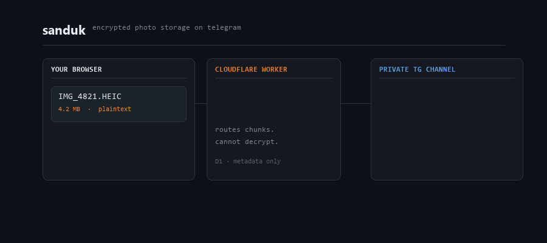

# Sanduk

[](LICENSE)
[](https://github.com/binay-py/storagesystem/stargazers)
[](https://github.com/binay-py/storagesystem/issues)

**Sanduk** is a zero-knowledge personal photo/video vault: files are encrypted in your browser, stored as ciphertext in Telegram, and indexed via Cloudflare Worker + D1.

> Repository name is `storagesystem`; product name is **Sanduk**.

<p align="center">
  
</p>

## Table of contents

- [Why Sanduk?](#why-sanduk)
- [Feature summary](#feature-summary)
- [Architecture at a glance](#architecture-at-a-glance)
- [Quick start](#quick-start)
- [Security model (summary)](#security-model-summary)
- [Comparison](#comparison)
- [Troubleshooting](#troubleshooting)
- [Roadmap](#roadmap)
- [Contributing](#contributing)
- [License](#license)

## Why Sanduk?

Sanduk is designed for people who want:

- private media storage where plaintext does not pass through the server
- low-cost self-hosting on Cloudflare free tier + Telegram private channel
- control over keys and infrastructure without a managed cloud photo account

## Feature summary

- Browser-side AES-GCM encryption for files, filenames, album names, and thumbnails
- Chunked upload/download via Telegram bot API
- Timeline, albums, favorites, trash (30-day purge), search, sorting
- Backup dedupe with content hashing
- Multi-select bulk actions and live-photo pairing support
- Installable PWA with Android share target
- Optional setup gate via `SETUP_CODE`

## Architecture at a glance

```text
Browser (WebCrypto)
  - derives auth token + encryption key from chest secret (HKDF)
  - encrypts media + metadata before upload
            |
            v
Cloudflare Worker (`src/worker.js`)
  - validates auth token hash
  - routes encrypted chunks to Telegram
  - stores encrypted metadata references in D1
            |
            v
Telegram private channel (ciphertext chunks)
D1 database (user id hash, encrypted names, IVs, chunk map, flags)
```

More detail: [`docs/architecture.md`](docs/architecture.md)

## Quick start

### Prerequisites

- Telegram account
- Cloudflare account (Workers + D1)
- Node.js 18+ and Wrangler CLI

### 1) Clone + authenticate Wrangler

```bash
git clone https://github.com/binay-py/storagesystem.git
cd storagesystem
npm install -g wrangler
wrangler login
```

### 2) Create local config

```bash
cp wrangler.toml.example wrangler.toml
```

### 3) Create D1 database and schema

```bash
wrangler d1 create sanduk
wrangler d1 execute sanduk --remote --file=./schema.sql
```

Copy the returned `database_id` into `wrangler.toml`.

### 4) Configure Telegram bot

1. Create a bot with [@BotFather](https://t.me/botfather)
2. Store token as a secret:

```bash
wrangler secret put TG_BOT_TOKEN
```

### 5) Setup private channel ID

1. Create a private Telegram channel
2. Add bot as admin with permission to post
3. Send one message in the channel
4. Set setup mode in `wrangler.toml`:

```toml
[vars]
TG_CHAT_ID = "SETUP"
```

5. Deploy:

```bash
wrangler deploy
```

6. Open `https://<your-worker>.workers.dev/setup.html`, click **find my channel**, copy ID
7. Replace in `wrangler.toml`:

```toml
[vars]
TG_CHAT_ID = "-1001234567890"
```

8. Deploy again:

```bash
wrangler deploy
```

### Optional: gate new chest creation

```bash
wrangler secret put SETUP_CODE
```

### Upgrade existing install

```bash
wrangler d1 execute sanduk --remote --file=./migration-v3.sql
wrangler deploy
```

## Security model (summary)

Sanduk aims for **client-side confidentiality**, not full anonymity or endpoint compromise protection.

| Component | Can see plaintext media? | Can see encrypted metadata? | Notes |
|---|---|---|---|
| Browser client | Yes (before encrypt / after decrypt) | Yes | Your key lives here |
| Cloudflare Worker | No | Yes | Sees request timing, sizes, auth token hash, ciphertext payload |
| D1 database | No | Yes | Stores encrypted names/album names + chunk references and flags |
| Telegram channel | No | Yes | Stores encrypted file chunks/thumbnails as bot uploads |

Important limitations:

- If you lose your Sanduk secret key, your data cannot be recovered.
- If Telegram channel data is deleted (or bot access removed), corresponding ciphertext is lost.
- Devices with unlocked sessions can access decrypted media.

This is **not a formal third-party security audit**. See full details: [`docs/security.md`](docs/security.md).

## Comparison

| Capability | Sanduk | Mainstream hosted photo cloud (e.g., Google Photos) | Self-hosted gallery (e.g., Immich/PhotoPrism defaults) |
|---|---|---|---|
| Browser encrypts media before upload by default | Yes | No | No |
| Self-hosted control path | Yes (Worker + D1 config) | No | Yes |
| Telegram as storage backend | Yes | No | No |
| Account recovery if key/password lost | No (key is required) | Usually yes (provider account recovery) | Depends on deployment/auth setup |

## Troubleshooting

- **`/setup.html` says setup closed (410)**
  - `TG_CHAT_ID` is already set to a real value. Set it to `"SETUP"`, deploy, finish setup, then set final channel ID and deploy again.
- **No channels found in setup page**
  - Ensure bot is channel admin and at least one message was posted in that channel.
- **Telegram API errors on upload**
  - Re-check `TG_BOT_TOKEN` secret and channel permissions.
- **D1 query/deploy failures**
  - Confirm correct `database_id` in `wrangler.toml` and DB binding name `DB`.
- **Cannot decrypt after returning later**
  - Verify the same Sanduk secret key is used; key mismatch is unrecoverable.

## Roadmap

See [`docs/roadmap.md`](docs/roadmap.md). Proposed items are ideas, not delivery promises.

## Contributing

- Read [`CONTRIBUTING.md`](CONTRIBUTING.md)
- Use issue templates in `.github/ISSUE_TEMPLATE/`
- Follow [`CODE_OF_CONDUCT.md`](CODE_OF_CONDUCT.md)
- For vulnerabilities, use [`SECURITY.md`](SECURITY.md)

## License

AGPL-3.0. See [`LICENSE`](LICENSE).
